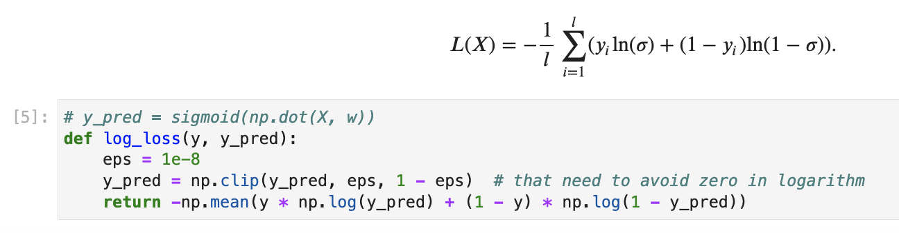
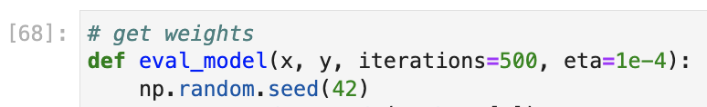
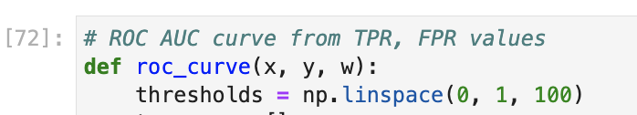

# Choose proper tutors for math exam

## Algorithms of data analysis. Classification. 

https://www.kaggle.com/c/gb-choose-tutors

In this internal GeekBrains competition we should be make classification model and were **not allowed** to use external libraries.

I've made custom logistic regression function with AUC ROC metric, got good result and **won top-3** place with **AUC ROC Score = 0.98392** on test data:

### Usage

It have some next steps into main project file [Classification.Choose tutors.ipynb](https://github.com/hildar/choose-tutors/blob/main/Classification.%20Choose%20tutors.ipynb):

Make functions for calculate standard scale, sigmoid and log loss function:

Make evaluate and metric functions:

Then fit and evaluate result:

At the end it is need to predict on test data, save *submission.csv* and send to Kaggle.
